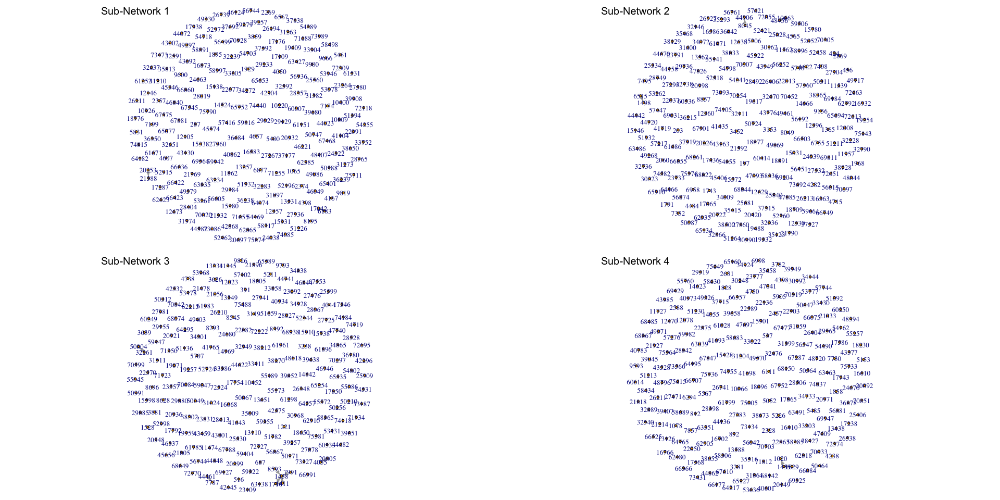
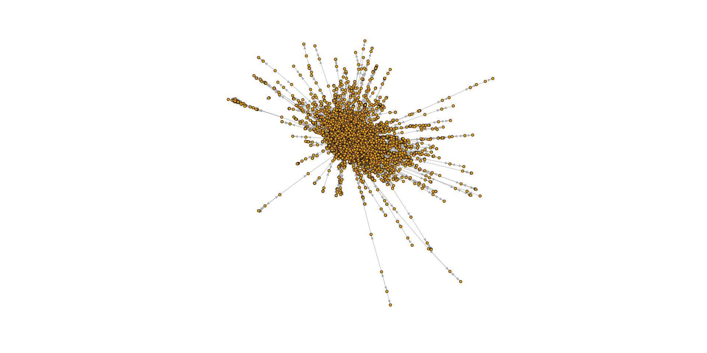
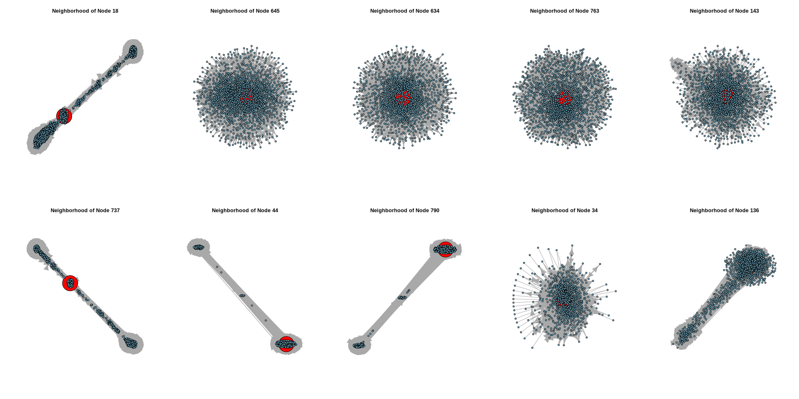
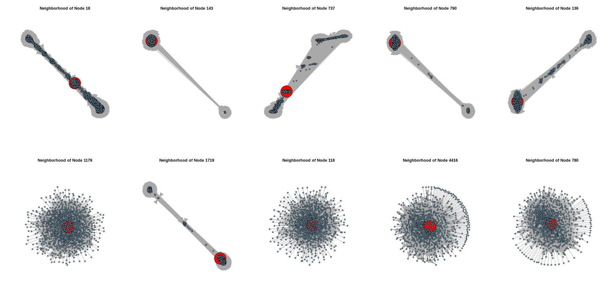
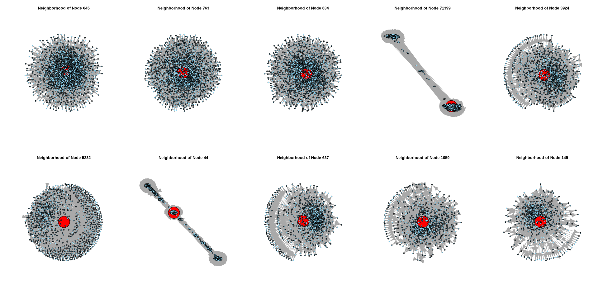
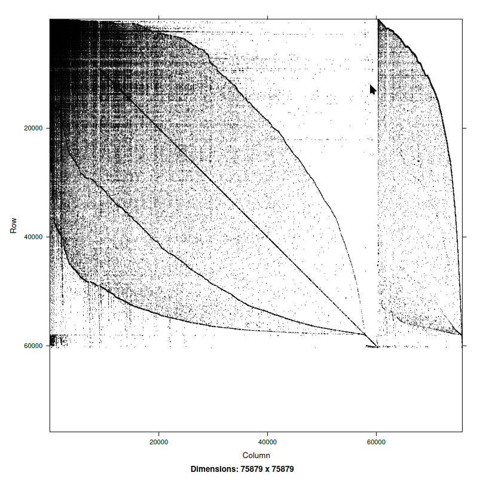

```{r setup, include=FALSE}
knitr::opts_chunk$set(echo = TRUE)
knitr::opts_chunk$set(fig.pos = "H", out.extra = "")
```

\newpage

## 1 Introduction

The Epinions dataset is a who-trust-whom online social network of a general consumer review site [Epinions.com](https://Epinions.com). Members of the site can decide whether to "trust" each other. The network consists of 75879 nodes and 508837 edges.

Analyzing this network can provide insight to the role of trust in online forums. The measurement of key metrics, such as the average degree of a given node, or the mean distance across the network, can provide insight on how users of other online forums may interact with each other. Furthermore, the visualization of this network, its communities, most central nodes, and adjacency matrix can allow us to more clearly identify trends in the network.

## 2 Methodology

The data processing involved was relatively straight forward. The edge-list for the network was downloaded from the SNAP dataset repository, and read into a DataFrame object in R. Using the `igraph` package, the data was transformed to an `igraph` object. The `igraph` package extends base R functions such as `plot` to allow for the interaction with the `igraph` object. Additionally, the package provides functions that allow for the measurement of metrics such as edge density, connectivity, etc., which will be investigated further below (\S 3).

## 3 Analysis

### 3.1 Induced Sub-Graphs: Randomly Selected Nodes

Four induced subgraphs, consisting of a random sample of 200 nodes each, are visualized below (Fig. 1). Only a small number of connections exist in each subgraph, indicating that there is weak connectivity between the nodes in each graph.

### 3.2 Network Metrics

The network has been summarized by various metrics, as displayed in the table below.

| Mean Distance | Edge Density | Reciprocity | Transitivity | Diameter | Connected Components? | Articulation Points | Modularity | 
| ------------------------ | ------------------------ | ------------------------ | ------------------------ | ------------------------ | ------------------------ | ------------------------ | ------------------------ | 
| 4.754723      | 8.83774e-05  | 0.405226    | 0.06567883   | 16       | No, 42176 nodes unconnected  | 15936 nodes         | 0.39       |

Each metric can be described as follows:

* Density: The ratio of edges in a graph to the total number of edges in the graph.
* Reciprocity: The ratio of total number of reciprocal edges relative to the total number of edges.
* Transitivity: The tendency of nodes to cluster.
* Reachability: The aggregate version of node-level reachability; the ability of one node to reach other nodes in a directed graph.
* Diameter: The longest possible shortest path between any pair of nodes in the graph.
* Connected components: The subgraphs within the graph such that all nodes are within the subgraph are connected by a path. Separated into strongly connected components and weakly connected components.
* Articulation points: The nodes that if removed would split the graph into different component subgraphs.
* Modularity: The measure of the density of connections within a communities; the communities which are _greedily_ formed with the `cluster_fast_greedy()` algorithm, included with the `igraph` package.

### 3.3 Community Detection

As stated above, the `cluster_fast_greedy()` algorithm _greedily_ forms communities within the network and attempts to find subsequent nodes which fit into these "communities". In the Trust Network, over 3200 communities were found. The 5 largest communities had 24051, 18925, 9590, 902, and 898 nodes, respectively. This tells us that the 5 largest groups contain just under 75% of all of the nodes in the network.

In addition to community detection at the network level, ten nodes which had the highest degrees were analyzed using the `ego()` function provided by the `igraph` package. The `ego()` function finds neighborhoods of nodes, at the node level. The top nodes were separated into three groups, those with the most connections to them, those with the most connections from them, and those with the most connections overall. Additionally, it should be noted that only 1-degree of separation was considered in each of the neighborhoods.

In plotting the neighborhoods for each of these groups (\S 4), observed were different patterns in the network layout. Some neighborhoods appeared as "linear", in a straight line, and others appeared more circular. The linear neighborhoods would appear when there are two or more distinct sub-neighborhoods that are only connected through another sub-neighborhood. Conversely, circular patterns would appear when sub-neighborhoods of the network were interconnected.

### 3.4 Adjacency Matrix

Due to the size and low density of the network, any adjacency matrices produced did not provide meaningful insight to the dataset (see \S 7.1 for the image).

## 4 Results

Upon immediate inspection of the dataset, and more specifically the inspection of the induced subgraphs of randomly selected nodes, it became apparent that the network density was very low (Fig. 1).

```{r dpi=400, out.width="50%", fig.align="center", fig.cap="Induced sub-graphs of random nodes in the network.", echo=FALSE}

```

Furthermore, investigating the network as a whole and the communities detected by the `cluster_fast_greedy()` algorithm proved that making inference on the underlying structure of the network remained difficult at the network level (see Figures 2-3 for reference).

```{r dpi=400, out.width="40%", fig.align="center", fig.cap="Graph of the full network.", echo=FALSE}

```

```{r dpi=400, out.width="50%", fig.align="center", fig.cap="Graph of the full network with color-coded communities.", echo=FALSE}
# knitr::include_graphics("./images/full_network_communities.png")
```

However, this is not to indicate that there are not meaningful connections within the network at the node level. Below are the plots (Figures 4-6) discussed above, these are plots of node-level neighborhoods, of 1 degree, for the 10 nodes with the most connections to, from, and both to and from the node, respectively. Notably, the red dots are the central node. The linear and circular patterns observed are artifacts of the default layout within the `plot()` function, as extended with the `igraph` package. Distance between two nodes directly corresponds to both the connectivity and density of the region. For example, in the neighborhood of node 18 (Fig. 4), we see a linear pattern with two clusters on either end and node 18, itself, is in between these two clusters. From this, we can infer that the user represented by node 18 has mutual trust with, what are essentially, two separate groups who are strictly unrelated with one another. Interestingly, taking a look at node 44 (Fig. 4), we notice that node 44 is within one of the clusters at the end of the linear pattern. This indicates that while the user represented by node 44 has mutual trust with those in the cluster at the other end of the pattern, there is not mutual trust between the users in either cluster. On the other hand, taking a look at an example of a circular pattern, nodes 645 (Fig. 3) is in the center of one single cluster. While any two users represented by nodes on opposite sides of the circular pattern may have mutual trust with one another, the distribution of those pairs is roughly even across the neighborhood. There are outliers in this trend, consider node 34 (Fig. 34), where certain nodes are significantly further on the perimeter in one spot, or to one side. However, in the case of node 34 at least, there are no arrows pointing towards node 34 from the outlier, which indicates that these nodes represents users that trust the user represented by node 34, but not vice versa.

Interestingly, we see the trend of linear and circular patterns persists across all variety of degree measurements. This may indicate the presence of two separate trends in trust. A linear pattern may indicate a users subscription to two schools of thought on a particular matter, where they may or may not be more affiliated with one more than the other. A circular pattern may indicate that a certain user has a large presence, overall, within the network, or they may be central to a particular school of thought on a particular matter. Ultimately, while the network at large may not present any overarching trends, the presence of patterns at this level indicates that further research should be welcomed in this area.

```{r dpi=400, out.width="100%", fig.align="center", fig.cap="Neighborhoods of top in-degree and out-degree nodes", echo=FALSE}

```

```{r dpi=400, out.width="100%", fig.align="center", fig.cap="Neighborhoods of top in-degree nodes", echo=FALSE}

```

```{r dpi=400, out.width="100%", fig.align="center", fig.cap="Neighborhoods of top out-degree nodes", echo=FALSE}

```


## 5 Conclusion

The Epinions Trust Network is fruitful evidence of patterns in trust in online forums, at the individual level. It is difficult to come by any meaningful evidence of structure at the network level. However, patterns displayed in node-level neighborhoods indicate that underlying structures do exist within this type of network, and there is information to be gained from studying them. Knowledge on this matter could certainly be extrapolated to other online forums and social media applications. Should data from this site be published on topics discussed by certain users or when trust was established between two users, further research would be highly suggested. Research on the correlation between each users particular use of language and the sub-neighborhoods they may or may not be apart of, or how a users trust network grows with relation to the topics they engage with, would likely yield interesting results.

## 6 References

“Epinions Social Network.” SNAP, snap.stanford.edu/data/soc-Epinions1.html. Accessed 29 May 2024.

## 7 Appendix

### 7.1 Additional Figures

```{r dpi=400, out.width="50%", fig.align="center", fig.cap="Adjacency matrix for network nodes.", echo=FALSE}

```

### 7.2 Code

```{r eval=FALSE}
#-----------------------------------------------------------------------------
library(igraph)
library(Matrix)

# default margins
def_marg <- c(5.1, 4.1, 4.1, 2.1)
# no margins
no_marg <- c(0, 0, 0, 0)
#-----------------------------------------------------------------------------
## Read in the raw edgelist and convert to igraph object
epinions.data <- read.table("./data/soc-Epinions1.txt", sep="\t", header=FALSE, 
                            col.names=c('from', 'to'), skip=4)
epinions <- graph_from_data_frame(epinions.data, directed=TRUE)
epinions
#-----------------------------------------------------------------------------
## Community detection + results
# NB: cluster_fast_greedy() only operates on undirected graphs
e.community <- cluster_fast_greedy(as.undirected(epinions))
e.community

largest_communities_sorted <- table(sort(sizes(e.community), decreasing=TRUE))[1:5]

largest_communities_names <- names(largest_communities_sorted)

cat("Length:", length(e.community), "\n")
cat("5 Largest Sizes:", largest_communities_sorted, "\n")
cat("Modularity:", modularity(e.community), "\n")
#-----------------------------------------------------------------------------
## Plot of all communities w/ color
vertex_size <- 2
edge_width <- 0.2

layout <- layout_with_fr(epinions)

V(epinions)$community <- e.community$membership
n_comms <- length(unique(e.community$membership))
set.seed(123)  # For reproducibility
color_palette <- rainbow(n_comms)

V(epinions)$color <- color_palette[V(epinions)$community]


plot(epinions,
     layout=layout,
     vertex.size = vertex_size,
     vertex.color = V(epinions)$color, 
     vertex.label = NA,
     vertex.frame.color = NA,
     edge.color = "gray80",
     edge.width = edge_width,
     edge.arrow.size = 0.1,
     edge.curved = 0.1)
#-----------------------------------------------------------------------------
## Plot the full network, simple
plot(epinions,
     layout=layout_with_fr,
     vertex.size=2,
     # === vertex label properties
     vertex.label=NA,
     # === edge properties
     edge.arrow.size=0.5)
#-----------------------------------------------------------------------------
deg <- degree(epinions, mode="all")
in_deg <- degree(epinions, mode="in")
out_deg <- degree(epinions, mode="out")
in_top_nodes <- V(epinions)[order(in_deg, decreasing=TRUE)[1:10]]
out_top_nodes <- V(epinions)[order(out_deg, decreasing=TRUE)[1:10]]
top_nodes <- V(epinions)[order(deg, decreasing=TRUE)[1:10]]
#-----------------------------------------------------------------------------
# High-out-Degree Nodes and Their Neighborhoods
neighborhood <- ego(epinions, order=1, nodes=top_nodes)

# Set up plotting layout
par(mfrow=c(2, 5))

# Plot each neighborhood
for (i in seq_along(neighborhood)) {
  # Extract the current neighborhood
  subgraph <- induced_subgraph(epinions, neighborhood[[i]])
  
  # Set vertex sizes: larger for the central node
  V(subgraph)$size <- ifelse(V(subgraph)$name == top_nodes[i]$name, 30, 3)
  
  # Set vertex colors: central node in red, others in sky blue
  V(subgraph)$color <- ifelse(V(subgraph)$name == top_nodes[i]$name, "red", "skyblue")
  
  # Plot the subgraph
  plot(subgraph,
       vertex.size=V(subgraph)$size,
       vertex.color=V(subgraph)$color,
       vertex.label=NA,
       main=paste("Neighborhood of Node", top_nodes[i]$name))
#-----------------------------------------------------------------------------
# High-out-Degree Nodes and Their Neighborhoods
neighborhood <- ego(epinions, order=1, nodes=in_top_nodes)

# Set up plotting layout
par(mfrow=c(2, 5))

# Plot each neighborhood
for (i in seq_along(neighborhood)) {
  # Extract the current neighborhood
  subgraph <- induced_subgraph(epinions, neighborhood[[i]])
  
  # Set vertex sizes: larger for the central node
  V(subgraph)$size <- ifelse(V(subgraph)$name == in_top_nodes[i]$name, 30, 3)
  
  # Set vertex colors: central node in red, others in sky blue
  V(subgraph)$color <- ifelse(V(subgraph)$name == in_top_nodes[i]$name, "red", "skyblue")
  
  # Plot the subgraph
  plot(subgraph,
       vertex.size=V(subgraph)$size,
       vertex.color=V(subgraph)$color,
       vertex.label=NA,
       main=paste("Neighborhood of Node", in_top_nodes[i]$name))
}
#-----------------------------------------------------------------------------
# High-out-Degree Nodes and Their Neighborhoods
neighborhood <- ego(epinions, order=1, nodes=out_top_nodes)

# Set up plotting layout
par(mfrow=c(2, 5))

# Plot each neighborhood
for (i in seq_along(neighborhood)) {
  # Extract the current neighborhood
  subgraph <- induced_subgraph(epinions, neighborhood[[i]])
  
  # Set vertex sizes: larger for the central node
  V(subgraph)$size <- ifelse(V(subgraph)$name == out_top_nodes[i]$name, 30, 3)
  
  # Set vertex colors: central node in red, others in sky blue
  V(subgraph)$color <- ifelse(V(subgraph)$name == out_top_nodes[i]$name, "red", "skyblue")
  
  # Plot the subgraph
  plot(subgraph,
       vertex.size=V(subgraph)$size,
       vertex.color=V(subgraph)$color,
       vertex.label=NA,
       main=paste("Neighborhood of Node", out_top_nodes[i]$name))
}
```
